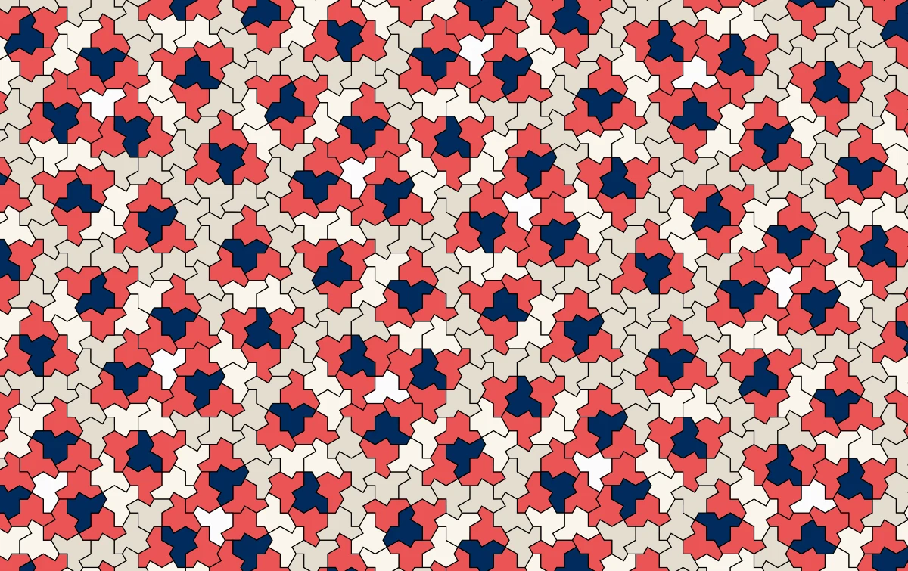
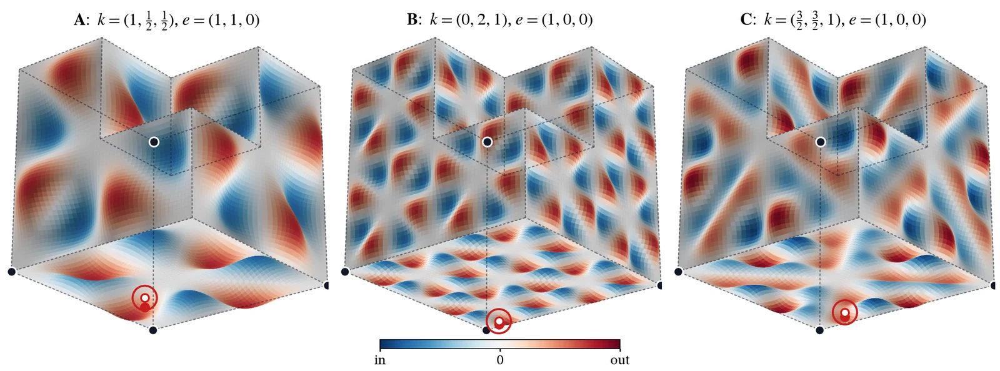

Recently, a 3D *einstein* tile has been making the rounds on the internet. It's called [Chair44](https://arxiv.org/abs/2609.19214), proposed in a preprint by Ioannis Tsiokos, and I wanted to see what it looks like. Basically, an einstein tile is a single shape that fills space, but only in patterns that never repeat. A few years ago (in 2023), a 2D tile received a lot of [media attention](https://www.theguardian.com/science/2023/apr/03/new-einstein-shape-aperiodic-monotile) because it was the first aperiodic *monotile*:

*Image: [Smith, Myers, Kaplan and Goodman-Strauss](https://cs.uwaterloo.ca/~csk/hat/), [CC BY 4.0](https://creativecommons.org/licenses/by/4.0/).*

The 3D one is a 2×2×2 cube with one corner missing (hence the name) plus 192 tiny pyramid bumps and dents. The bumps are exactly the reason why it is aperiodic, since neighbors have to fit a bump into a dent in a very specific way.

So I rebuilt the geometry from the [paper's data](https://github.com/ioannist/six-birds-tiles) and made a small [3D explorer](https://sager611.github.io/einstein-tile-3d-viz/) with Three.js using GPT-6 Astra and Opus 5.5.

<figure><iframe src="https://sager611.github.io/einstein-tile-3d-viz/" title="Chair44 3D explorer" loading="lazy" style="display:block;width:100%;height:600px;border:0"></iframe></figure>

Then I got curious whether you could change the shape and keep it working, so I got Opus 5.5 to investigate. In a couple of prompts, it discovered that if you bend space with a tiny smooth wave following the same Chair44 symmetries, you can have infinite families of new tiles. Here are 3 example families:

Just to verify (you cannot trust AI), I got it to generate the [Lean proofs](https://github.com/Sager611/einstein-tile-3d-viz/tree/main/lean). You can check out these warps by clicking on the "Warp" icon in the visualization.

The whole project is on GitHub: [Sager611/einstein-tile-3d-viz](https://github.com/Sager611/einstein-tile-3d-viz).

> \[!warning\]
> All of this, Lean proofs included, was vibecoded with AI and little supervision. The proofs also assume the paper's main theorem, which is still a preprint, and only cover bends up to $10^{-9}$ (the visualization magnifies them about $10^7$ times). Proceed at your own risk.

